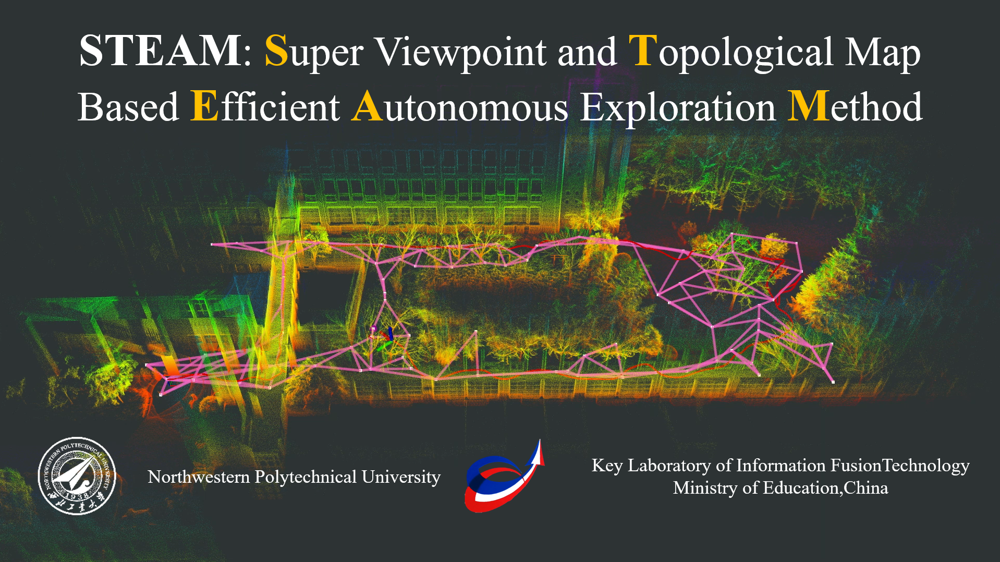

# STEAM

> **Submitted to IEEE Transactions on Intelligent Transportation Systems**

Learn more about our projects (Click the image below to view the YouTube video.)

  

## 🎥 Demonstration
####  🚁 Real-World Flight

We validated the algorithm on a custom-built UAV platform in unstructured environments. The system demonstrates robust performance with onboard computing.

#### 📊 Benchmark Results

Qualitative comparison against state-of-the-art methods (FUEL, Star-Searcher, EPIC, etc.) in diverse environments ...

##  🤝 Open Source Commitment

We are committed to reproducible research.  As with our previous work on **[LAEA: A 2D LiDAR-Assisted UAV Exploration Algorithm](https://github.com/Poaos/LAEA)**, the full source code for **STEAM** will be released **immediately upon acceptance**.

